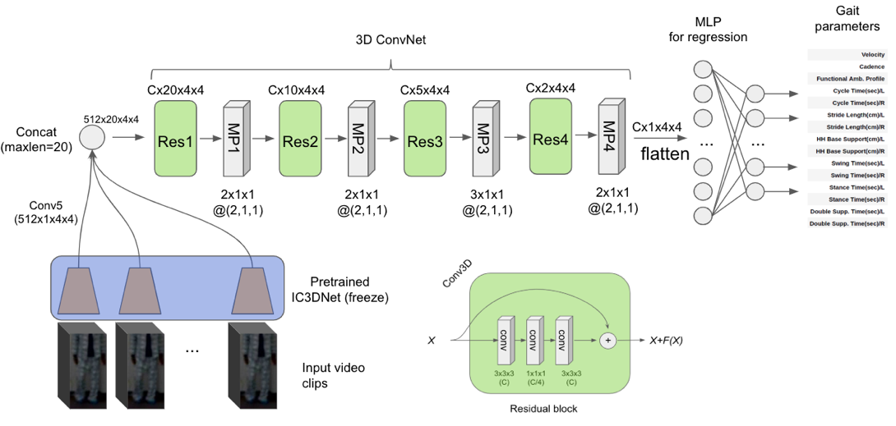
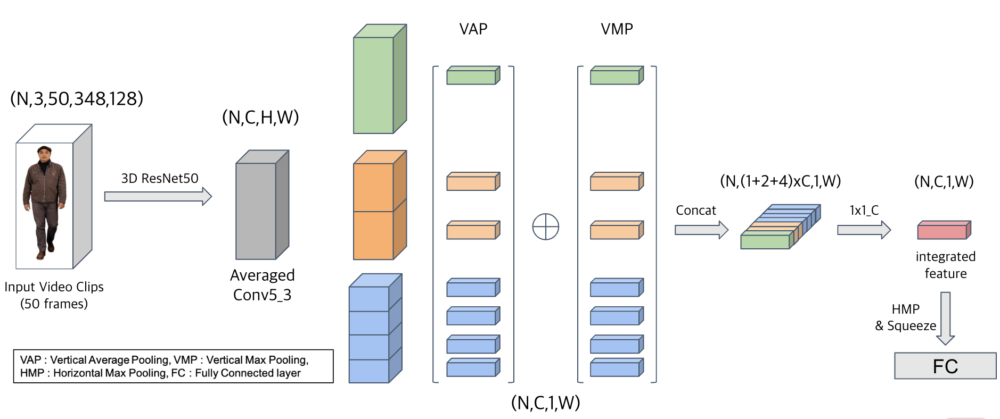

# GaitAnalysis Project for CHR
### System overview


### Baseline


### Variant of HPP (Horizontal Pyramid Pooling); advanced


### Multi-scaled Attented Model 
- pixel-wise attention will be applied

### Requirements
- Anaconda, CUDA 9.0, cuDNN 7.0.7
```shell script
# create conda env from .yml file
conda env create -f env.yml

# activate conda env (name='torch')
conda activate torch
```

### Usage
* Setting for git repository
    - **Important!!!**
        - as this project is under development, you need to checkout to 'develop' branch after cloning!
        ```shell script
        git checkout develop
        ```
        - "preprocess" is submodule managed by our another git. So you need to update this module
        ```shell script
        # cd to preprocess root
        cd preprocess
        
        # this repos is also under development
        git checkout develop
        ```
* Preprocess
    - Data samples are splited into 8(=default) chunks.
    - Based on the "device_yolo" flag, independent process will be generated.
    - If you want to run 8 parallel process, you can do it by executing 8 scripts which only "--device_yolo" flag is different (0~7, it depends on your settings).
  ```shell script
  python generate_dataset.py --data_gen 
    --input_file=preprocess/data/person_detection_and_tracking_results_drop.pkl
    --target_file=preprocess/data/targets_dataframe.pkl
    --darknet_api_home=preprocess/darknet
    --meta_home=/data/GaitData/MetaData_converted
    --fps=24
    --device_yolo=0  
  ```

* Note that all of the ( train | test | demo ) scrips can be run at root path of "src/dev"
    ```shell script
    # cd to root path of development src
    cd src/dev
    ```
  
* Training
    - Feature extraction : ( naive | HPP )
        - Default backbone network : pretrained 3D ResNet50; ResNet101,ResNext,DenseNet,... another variants of ResNet can be utilized by changing '--backbone' and '--model_depth' flag. (Unfortunately, now only support ResNet50)
        - naive : do not consider multiple scale feature integration, only global scale.
        - HPP(Horizontal Pyramid Pooling) : integrate feature map of multi-scaled vertical bins.
            - Merging method : ( addition | 1x1_C )
                - addition : after 1x1_C for each bin, add all. 
                - 1x1_C : after concatenating each vertically pooled (VAP+VMP) bin through channel dimension, 1x1_C is applied.

    ####naive
    ```shell script
    python main.py --backbone=resnet
        --model_depth=50
        --pretrained_path=pretrained/resnet-50-kinetics.pth
        --multi_gpu
        --device_ids=0,1,2,3,4,5,6,7
        --batch_size=32
        --learning_rate=1e-2
        --n_threads=16
        --mode=train
        --model_arch=naive
        --n_iter=101
        --CV=5
        --warm_start
        --n_groups=4
    ```

    #### HPP -> addition
    ```shell script
  python main.py --backbone=resnet
    --model_depth=50
    --pretrained_path=pretrained/resnet-50-kinetics.pth
    --multi_gpu
    --device_ids=0,1,2,3,4,5,6,7
    --batch_size=32
    --learning_rate=1e-2
    --n_threads=16
    --mode=train
    --model_arch=HPP
    --merge_type=addition
    --n_iter=201
    --CV=5
    --warm_start
    --n_groups=4
    ```
    
    #### HPP -> 1x1_C
    ```shell script
  python main.py --backbone=resnet
    --model_depth=50
    --pretrained_path=pretrained/resnet-50-kinetics.pth
    --multi_gpu
    --device_ids=0,1,2,3,4,5,6,7
    --batch_size=32
    --learning_rate=1e-2
    --n_threads=8
    --mode=train
    --model_arch=HPP
    --merge_type=1x1_C
    --n_iter=201
    --CV=5
    --warm_start
    --n_groups=4
    ```
  
  
* Testing
    ```shell script
    # validate for test dataset (in this case, "HPP->1x1_C" at 30th epoch)
    python main.py --backbone=resnet
        --model_depth=50
        --pretrained_path=pretrained/resnet-50-kinetics.pth
        --multi_gpu
        --device_ids=0,1,2,3,4,5,6,7
        --batch_size=32
        --n_threads=16
        --mode=test
        --test_epoch=30
        --model_arch=HPP
        --merge_type=1x1_C
        --n_groups=4
    ```
* Demo
    - User can post ( *.avi | *.mp4 ) video file to this server, and get regression results in the form of bar-chart.
    - Medically safe region will be specified later...
    
    ```shell script
    # run Flask Server at 40000 (in this case, "HPP->1x1_C" model is tested trained for 30 epochs)
    python main.py --backbone=resnet
        --model_depth=50
        --pretrained_path=pretrained/resnet-50-kinetics.pth
        --device_ids=0
        --mode=demo
        --test_epoch=30
        --model_arch=HPP
        --merge_type=1x1_C
        --interval_sel=COP
        --device_yolo=8
        --n_groups=4
        --port=40000  
    ```

### Liscence
    Not determined yet.