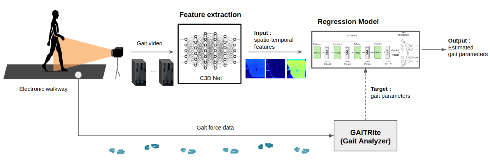

<p align="center">
  
  
  <h1 align="center">Gait Analysis Project</h1>
    
</p>

This is the official repo for paper **Quantitative gait analysis of idiopathic normal pressure hydrocephalus using deep learning algorithms on monocular videos** published in Scientific Reports 2021: [Quantitative gait analysis of idiopathic normal pressure hydrocephalus using deep learning algorithms on monocular videos](https://www.nature.com/articles/s41598-021-90524-9)

## Requirements

- Anaconda, CUDA 9.2, cuDNN 7.6.3

```shell script
# create conda env from .yml file
conda env create -f docker/environment.yml

# activate conda env (name='torch')
conda activate torch
```

### Usage

1. Clone this repo to local

```
git clone https://github.com/youhs4554/gaitanalysis.git
```

2. Change directory to our main source code folder `src/dev`

```
# cd to root path of development src
cd src/dev
```

3. Preprocess (YOLO detection file + target file generation)

- Data samples are splited into 8(=default) chunks.
- Based on the "device_yolo" flag, independent process will be generated.
- If you want to run 8 parallel process, you can do it by executing 8 scripts which only "--device_yolo" flag is changed (0~7, it depends on your settings).

```
python generate_dataset.py --data_gen
  --video_home=/data/GaitData/Video
  --input_file=../../preprocess/data/person_detection_and_tracking_results_drop.pkl
  --target_file=../../preprocess/data/targets_dataframe.pkl
  --darknet_api_home=../../preprocess/darknet
  --mode=preprocess__frame
  --meta_home=/data/GaitData/MetaData_converted
  --fps=24
  --device_yolo=0
```

4. Before training or testing, `visdom` should be activated for logging results

```
# run visdom server
visdom
```

5. Prepare gait video dataset </br>
   (1) Locate the video frames at `/data/GaitData/RawFrames`. Subfolders need to be named as each video filename without its extention (such as `.avi`). </br> **Note**: Each video name should be anonymized. </br>
   (2) Prepare person detection results for each video frame in python pickle file format (`.pkl`). </br>

   ```python
   # example of the detection #
                       vids idx                                                pos
   0  7119824_test_0_trial_3  83  171.8476104736328,0.74737548828125,418.3994598...
   1  7119824_test_0_trial_3  84  162.7849578857422,4.991180419921875,418.596694...
   2  7119824_test_0_trial_3  85  155.2943572998047,3.7421722412109375,425.62208...
   3  7119824_test_0_trial_3  86  153.48960876464844,8.34130859375,423.816116333...
   4  7119824_test_0_trial_3  87  150.11587524414062,3.5623321533203125,425.6660...
   ```

   (3) Prepare target file (i.e., gait analysis results) for each video sample in the pickle file as well. </br>

   ```python
   # example of the gait analysis result #
                Velocity  Cadence  Functional Amb. Profile  Cycle Time(sec)/L  Cycle Time(sec)/R  Stride Length(cm)/L  ...  Stance % of Cycle/L  Stance % of Cycle/R  Double Supp % Cycle/L  Double Supp % Cycle/R  Stride Length Var/L  Stride Length Var/R
   314465_0_0     113.2    105.6                     99.0              1.125              1.136              130.733  ...            62.222222            61.883803              24.444444              23.151408             3.678724            14.814801
   314465_0_1     117.6    109.8                     91.0              1.094              1.092              128.690  ...            62.248629            61.904762              23.674589              24.542125            51.222649            19.660356
   314465_0_2     111.3    106.9                     91.0              1.128              1.128              128.347  ...            62.322695            61.347518              23.670213              24.645390            43.811161            48.874081
   314465_0_3     115.9    108.1                     97.0              1.111              1.100              128.682  ...            62.556256            61.363636              23.672367              24.818182            53.772889             7.398400
   379233_0_0      42.3     87.8                     57.0              1.366              1.386               57.793  ...            70.204978            71.789322              42.972182              43.650794            25.010001            23.328900
   ```

6. Training model

- `5-fold` cross-validated R<sup>2</sup> scores (higher is better, max=1.0) per each gait variable are reported after finishing entire training process. And the results are saved in `logs/${model_name}/CV/results.json`

  (1) pretraining : pre-training gait variables with `average` type </br>

  ```
  ./scripts/pretrain_agnet_for_avg.sh
  ```

  (2) fine-tunning : fine-tunning gait variables with `Coefficient of Variation (CV)` type </br>

  ```
  ./scripts/finetune_agnet_for_CV.sh
  ```

7. Testing

- The hold-out test R<sup>2</sup> scores per each gait variables are measured
- Results are saved in `logs/${model_name}/test/results.json`
- Full results are saved in `logs/${model_name}/test/full_testing_results.pkl`

  (1) Test result example (`*/test/results.json`) </br>

  ```shell script
  ======Scores summary======
  {'Velocity': 0.962181106592635, 'Cadence': 0.8952900766881972, 'Cycle Time(sec)/L': 0.9006188007662291, 'Cycle Time(sec)/R': 0.9029606386623102, 'Stride Length(cm)/L': 0.970534942974641, 'Stride Length(cm)/R': 0.9723342032141757, 'HH Base Support(cm)/L': 0.9164981929913867, 'HH Base Support(cm)/R': 0.9179630231789094, 'Swing % of Cycle/L': 0.8950110491692309, 'Swing % of Cycle/R': 0.9061069494169072, 'Stance % of Cycle/L': 0.8961151170340987, 'Stance % of Cycle/R': 0.9058227596708904, 'Double Supp % Cycle/L': 0.9410649153067103, 'Double Supp % Cycle/R': 0.9347108097041955, 'Toe In / Out/L': 0.835253422531407, 'Toe In / Out/R': 0.7613705312781748, 'CV Stride Length/L': 0.6872706174289845, 'CV Stride Length/R': 0.7004818555806176, 'CV Stride Time/L': 0.4571908395452591, 'CV Stride Time/R': 0.5596036529274697}
  ```

  (2) Full test result example (`*/test/full_testing_results.pkl`) </br>

  ```python
  # read full result file
  df = pd.read_csv(full_result_file)

  # Note: df has multi-colums named 'y_true' and 'y_pred'
  print(df['y_true'])
  >>> Velocity     Cadence  Cycle Time(sec)/L  ...  CV Stride Length/R  CV Stride Time/L  CV Stride Time/R
   0  59.799999   90.699997              1.340  ...            5.937325          6.119403          4.761905
   1  72.300003  104.199997              1.152  ...            6.507646          3.038194          0.617829
   2  74.300003  116.099998              1.033  ...            7.360640          3.194579          2.408478
   3  97.800003  103.000000              1.144  ...            4.485812          3.321678          3.605150
   4  86.500000  118.099998              1.004  ...            5.285750          2.091633          2.463054

  print(df['y_pred'])
  >>> Velocity     Cadence  ...  CV Stride Time/L  CV Stride Time/R
   0  64.234039   95.202454  ...          4.352962          4.769241
   1  74.779884  104.415543  ...          1.105879          1.384702
   2  72.904884  117.950737  ...          2.128190          2.586742
   3  98.125877  102.045570  ...          2.638939          2.695043
   4  87.567299  113.467651  ...          1.150534          1.762770

  ```

## Citation

```
@article{jeong2021quantitative,
    title = {Quantitative gait analysis of idiopathic normal pressure hydrocephalus using deep learning algorithms on monocular videos},
    author = {Jeong, Sungmoon and Yu, Hosang and Park, Jaechan and Kang, Kyunghun},
    journal = {Scientific Reports},
    volume = {11},
    number = {1},
    pages = {1--10},
    year = {2021},
    publisher = {Nature Publishing Group}
}
```
